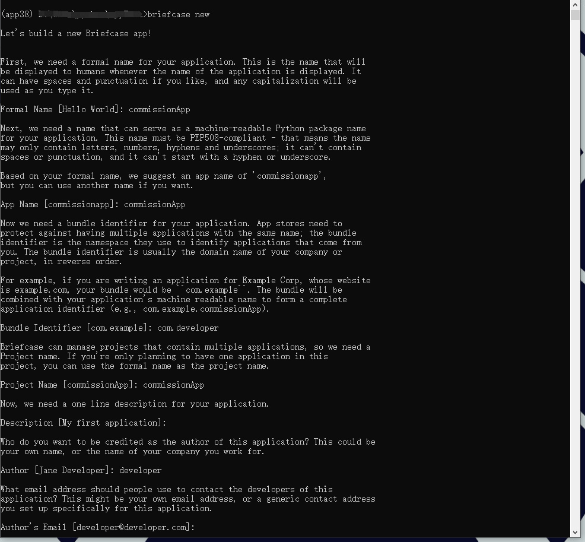

# python 四步生成安卓 APK 右手就行！
## “Less is more!”
#### 看着家中老父亲坐那一笔一划的算着抽成比例，头发掉的让人心疼，寻思整个小APP工具给他才有了下面的工作。
## 1. 配置环境
```sh
    # 为工程创建一个conda下的虚拟环境
    conda create -n apk38 python=3.8
    conda activate apk38

    # 安装 BeeWare 包
    pip install briefcase

    # 安装成功后，利用工具包创建 project
    briefcase new
    # 正常下，会让我们来输入 [应用正式名称]、[程序名称]、[域]、[项目名称]，等等这里就简单的设置一下,可默认
```
我这里的配置结果:



**上述操作成功就会在当前目录创建应用，并 cmd 打印提示`cd commissionApp`、`breifcase dev`**
整个目录文件初始状态如下：


## 2. 在app.py里编写主要代码，初始已经有一个demo
根据官方文档稍作修改，pdf文档 (docs-beeware-org-en-latest.pdf)，运行 hello world：


然后根据自己的需要编写实现！
我这里顺手又做了一个简化版的的抽成算账小工具，应该对于初步理解和使用 Bee Ware 有所帮助，emmmm，啥都没有的 APP 竟然快 30M 了，绝了！记得以前h5写过飞机大战游戏安卓APP，才2M多点。
最终界面结果：


以上展示都是在windows下进行的。
## 3. 打包为平台程序
**首先进行创建跨平台框架，简单理解就是 配置如何将 python 解释为windows、Android平台程序**
```sh
# 无参就默认打包为windows程序，结果是 .msi 安装程序
briefcase crete
# 打包为 Android 程序 则是加上 android 参数
briefcase crete androif
# 一下以 打包为 apk 程序为例

# 进行构建 Android 程序,
briefcase build android

# 本机运行构建好的安卓应用
# 如果使用虚拟机，则需要安装虚拟机环境，琢磨着可能需要科学上网，实际省略也没问题
# 可连接手机使用，我是直接跳过，直接传手机安装测试。
briefcase run android

# 最终打包安卓应用
briefcase package android
```
中间如果出错并提示检查是否 online，确定在线后多运行几次应该就可以了，估计科学上网就没这些问题，emmmmmm

最终成功之后则可以可以在根目录下找到 android 文件夹
其中`android\gradle\commissionApp\app\build\outputs\apk\debug`下就可以找到 apk 安装文件了。
`android\gradle\commissionApp\app\build\outputs\bundle\release`文件夹下`.abb`文件可用于上架谷歌商店。

## 4. 安装测试
传到手机上之后安装运行，最终界面如下：


这样，我们就把Python编写的图形程序直接打包为了安卓APP。

IOS的打包流程也是类似，大家可以参考官网文档尝试一下。